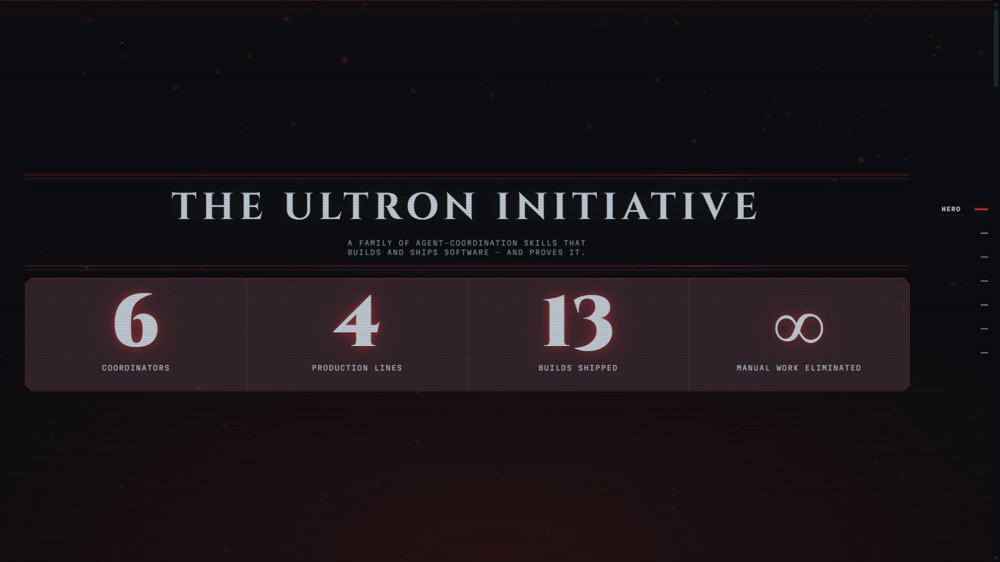
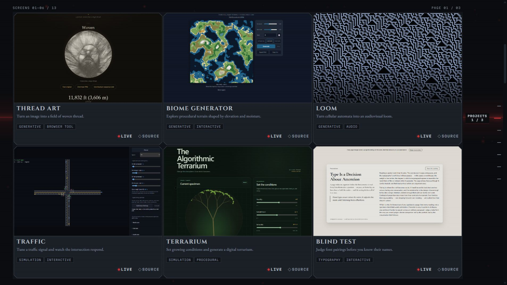
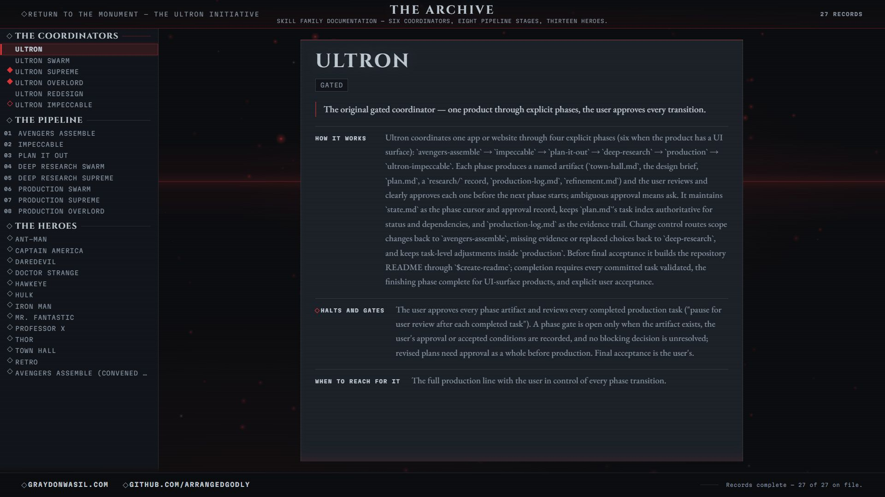

# The Ultron Initiative

**Explore the operating modes, supporting skills, and real builds behind a personal AI-assisted software workflow.**

The Ultron Initiative gives the skill family a public home: a cinematic project showcase and an interactive documentation archive. Browse the experiments it helped produce, compare the coordinators, and follow the roles and review gates that connect planning to verified work.



*The showcase brings the family’s crimson-and-gunmetal identity into the interface itself.*

[Explore the source](https://github.com/Arrangedgodly/ultron) · [Archive page source](skills.html) · [Graydon Wasil](https://graydonwasil.com/)

> **Repository scope:** this repository contains the showcase website and its documentation data. It does not contain an installable collection of the underlying `SKILL.md` files. Cloning the site lets you run and edit the website; it does not install the Ultron workflows into a coding agent.

## Two ways to explore

| Surface | What you can do |
|---|---|
| **Showcase** · `index.html` | Move through the hero, project wall, six-member roster, lineage, and closing links. Open a project’s live site or source from its card. |
| **Archive** · `skills.html` | Select an operating mode, pipeline component, or supporting role and read its mechanism, responsibilities, and documented limits. |

The current project wall holds **13 builds** with real, locally stored screenshots. The archive contains **27 entries** across **6 family members, 8 pipeline skills, and 13 entries in its Heroes group**. These are the contents of this website’s data, rather than a guarantee that a separately installed skill collection has the same version or membership.

## Follow the work



*Each project card connects its visual result to a live experience and a source repository.*

The build wall includes tools for typography, generative art, music, reading, simulation, and other experiments. Each record carries a title, description, tags, date, pipeline credit, and links. The current entries use a general “Ultron pipeline” credit; the website does not infer which specific variant built a project.

On a wide display, the wall divides into pages of cards. On a phone, it becomes a horizontal card pager inside the main vertical experience. Use the previous/next controls or swipe sideways to inspect projects, then scroll vertically to continue through the showcase.

The stage-navigation buttons provide direct access to the main sections. Stage hashes such as `#wall`, `#roster`, and `#frieze` can also be used in links. On desktop, `#wall-N` selects a layout-dependent wall page; on the phone pager, it selects the Nth project screen. Values beyond the available range clamp to the last page or screen.

## Choose an operating mode

The family is a set of different workflows, not a ladder where each entry replaces the last.

| Mode | Focus | Human involvement described in the archive |
|---|---|---|
| **Ultron** | A phased production workflow with explicit review | Approval at phase transitions and after completed production tasks |
| **Swarm** | Delegate task work while keeping the coordinator’s context small | Preserves the original review gates |
| **Supreme** | Continue production after initial direction and planning | Initial user touchpoints, independent task verification, and an explicit halt list |
| **Overlord** | Work against a defended two-hour target | Consolidated intake, task budgets, prioritization, and the same protected halt conditions |
| **Redesign** | Replace an existing product’s visual direction | The user locks direction, surfaces, and design choices |
| **Impeccable** | Critique and refine the finish | A finishing component with approval or verified automatic operation |

Overlord’s **120 minutes is a target, not a guaranteed delivery time**. The archive describes scope deferral as a way to protect the budget while retaining verification. Supreme and Overlord also describe halts for actions such as external publishing and destructive operations. The website explains these behaviors; it does not execute agents or grant them permissions.

## Read the archive



*The index selects one detailed entry at a time, with links that preserve the selected skill.*

The archive groups its entries into **Family**, **Pipeline**, and **Heroes**. Select a group, then an entry. Family records explain how a mode works, its autonomy level, its gates, and when to use it. Pipeline records describe phase responsibilities. Supporting-role records describe their review lens, work, and recorded invocation points.

| Control | Result |
|---|---|
| Click or tap an entry | Select its detail panel and update the URL hash |
| Click a group button | Move to that group’s first entry |
| Arrow keys while the index is focused | Move through the visible entries, wrapping at either end |
| Home / End | Select the first or last visible entry |
| Type the start of a name | Jump to a matching visible entry; the prefix resets after a short pause |
| Escape | Clear the current typeahead prefix |
| Tab | Leave the index and move into the selected panel and onward |
| Browser Back / Forward | Revisit selections made through links and clicks |

Keyboard walking replaces the current hash instead of adding a history entry for every keystroke. Direct hashes such as `skills.html#skill-ultron-supreme` select the corresponding record on load.

The archive includes historical and supporting entries as well as active coordinators. For example, its content distinguishes the older Town Hall skill from Avengers Assemble, and records no Ultron invocation for Retro. The archive is a description of the family, not an assertion that all listed entries are automatically called in every run. Its eight pipeline entries also omit separate records for the base `deep-research` and `production` skills used by original Ultron.

## Run locally

No package installation or build step is required.

```sh
git clone https://github.com/Arrangedgodly/ultron.git
cd ultron
```

Open `index.html` in a browser. Open `skills.html` to go directly to the archive. The site uses classic scripts and repository-relative assets so its content can load from `file://` without a development server.

If you prefer HTTP and already have Python installed:

```sh
python -m http.server 8000 --bind 127.0.0.1
```

Then visit `http://127.0.0.1:8000/`. A static host can serve the same files without a bundler. Preserve the directory structure so both pages, images, scripts, styles, and fonts remain accessible.

## Edit the content

| File | Owns |
|---|---|
| `data/builds.js` | Project records, screenshot paths and dimensions, and the four showcase counter labels |
| `data/timeline.js` | Ordered lineage milestones and optional dates |
| `data/skills.js` | Family, pipeline, and supporting-role documentation |
| `skills.html` | Archive page and its baked, no-JavaScript documentation snapshot |
| `js/render.js` | Showcase rendering, roster presentation, and responsive project pagination |
| `css/tokens.css` | Shared visual tokens |
| `assets/shots/` | Vendored project screenshots |

### Add a project

Add a record to `window.ULTRON_BUILDS` in `data/builds.js`:

```js
{
  id: "my-project",
  title: "My Project",
  description: "What a visitor can do with it.",
  tags: ["Browser tool", "Interactive"],
  url: "https://example.com/",
  sourceUrl: "https://github.com/you/my-project",
  created: "2026-10-05",
  builtWith: "Ultron pipeline",
  image: "assets/shots/my-project.png",
  imageWidth: 1440,
  imageHeight: 900
}
```

Use the project’s actual date, URL, screenshot dimensions, and production credit. Image fields are optional; without an image, the card uses its designed fallback. Required fields are checked during loading, and malformed records are skipped with a warning that names the offending data file and field.

The counter labels are separate data. If the inventory changes, review `ULTRON_STATS` as well. The decorative infinity claim about manual work is not measured usage or performance telemetry.

### Update a milestone or skill

Milestones live in `window.ULTRON_TIMELINE`. Keep `date: ""` when a date is unknown; the renderer uses an ordinal instead of inventing one.

For archive changes, follow the field schemas at the top of `data/skills.js`. Preserve the distinction between required content and the nullable `when_ultron_calls_it` field. A missing invocation record should remain explicit rather than being filled with a guessed relationship. Review the archive against the actual skill definitions whenever those definitions evolve.

After changing archive data, also refresh the baked fallback in `skills.html`: render the three content mounts through `js/skills.js` without the console enhancer, then serialize those mounts into the static page as its source comment describes. Do not maintain a second hand-written version of the content. This keeps the no-JavaScript document aligned with the interactive archive.

## Under the hood

| Layer | Implementation |
|---|---|
| Pages | Static HTML with semantic sections and links |
| Content | Validated JavaScript data globals, with no runtime content API |
| Interface | Vanilla JavaScript, DOM rendering, URL hashes, and responsive CSS |
| Motion | Canvas particle fields, staged entrances, scan sweeps, and selection feedback |
| Typography | Locally hosted Cinzel, Martian Mono, and EB Garamond |
| Delivery | Static files; no framework, package manager, or build pipeline required |

The pages use locally hosted fonts and images rather than runtime CDN dependencies. Following a project or profile link naturally opens its external destination. There is no account system, backend, analytics dashboard, skill installer, or agent-execution service in this repository.

Motion is designed to respond to `prefers-reduced-motion`. The archive settles active effects when the preference changes. If its console enhancement cannot initialize but the data-rendering scripts succeed, the underlying stacked documentation remains available. With JavaScript disabled, the showcase explains that its data-driven content needs scripting. The archive retains its baked continuous document, including its entries, without the interactive index.

## Check a change

This repository does not include a package-script test runner. Before publishing content or layout edits:

- Open both pages and inspect the browser console for data-validation warnings.
- Check every new image and live/source link.
- Test desktop and narrow layouts, including the project pager.
- Navigate the archive by pointer, keyboard, direct hash, and browser history.
- Confirm content remains readable with reduced motion enabled and that the archive’s static fallback is current with JavaScript disabled.
- Review any claimed workflow behavior against the actual skill source.

The fonts’ licenses are included under `assets/fonts/licenses/`. Preserve those notices when reusing the bundled fonts. The repository’s current tree does not include a general software `LICENSE` file.
